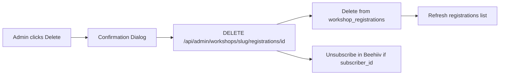

# Admin Delete Workshop Registrants

## Current State

- **Workshop registrations** (`[app/admin/(dashboard)/workshops/[slug]/page.tsx](app/admin/(dashboard)`/workshops/[slug]/page.tsx)): Table shows name, email, registered date—no delete button. Data lives in `workshop_registrations` (Supabase) and optionally in Beehiiv (`beehiiv_subscriber_id`).
- **Cohort applications** (`[components/admin/application-table.tsx](components/admin/application-table.tsx)`): Delete already exists—trash icon on row hover, confirmation dialog, `DELETE /api/admin/applications/:id`. If you don’t see it, it appears on hover in the rightmost column.

## Scope

Add delete for **workshop registrations** only. Cohort delete is already implemented.

---

## Implementation

### 1. Beehiiv unsubscribe helper

Add to `[lib/beehiiv.ts](lib/beehiiv.ts)`:

```ts
export async function unsubscribeBeehiivSubscriber(subscriberId: string): Promise<void> {
  const { apiKey, publicationId } = assertBeehiivConfig();
  const response = await fetch(
    `${BEEHIIV_API_URL}/publications/${publicationId}/subscriptions/${subscriberId}`,
    {
      method: "PUT",
      headers: {
        Authorization: `Bearer ${apiKey}`,
        "Content-Type": "application/json",
      },
      body: JSON.stringify({ unsubscribe: true }),
    }
  );
  if (!response.ok) {
    const errorText = await response.text();
    throw new Error(`Beehiiv unsubscribe error: ${response.status} ${errorText}`);
  }
}
```

Beehiiv docs: `PUT /subscriptions/{id}` with `unsubscribe: true` marks the subscriber inactive without deleting data.

### 2. DELETE API for workshop registrations

Create `[app/api/admin/workshops/[slug]/registrations/[id]/route.ts](app/api/admin/workshops/[slug]/registrations/[id]/route.ts)`:

- Auth: same pattern as existing registrations GET (admin email check).
- Load registration by `id`, ensure `workshop_slug` matches `slug` (for security).
- If `beehiiv_subscriber_id` exists, call `unsubscribeBeehiivSubscriber(subscriberId)` (best-effort; log and continue).
- Delete from `workshop_registrations` where `id` eq.
- Return `{ success: true }` or error.

### 3. UI: delete button + confirmation dialog

Update `[app/admin/(dashboard)/workshops/[slug]/page.tsx](app/admin/(dashboard)`/workshops/[slug]/page.tsx):

- Add `deleteTarget: WorkshopRegistration | null` and `isDeleting: boolean` state.
- Add an Actions column with a trash icon (same pattern as `ApplicationTable`—hover to show).
- On click, set `deleteTarget` to open the dialog.
- Use `Dialog` from `@/components/ui/dialog` (or existing `Dialog` if different) with:
  - Title: "Delete registration"
  - Body: "Are you sure you want to remove {name} ({email})? This will remove them from the workshop list and unsubscribe them from Beehiiv."
  - Cancel / Delete buttons.
- On confirm, `DELETE /api/admin/workshops/${slug}/registrations/${deleteTarget.id}`.
- On success: clear `deleteTarget`, call `fetchRegistrations()`.

---

## Data Flow




---

## Optional: Cohort delete visibility

If the cohort delete is hard to find, consider:

- Making the trash icon always visible (remove `opacity-0 group-hover:opacity-100`), or
- Adding a small "Delete" label next to the icon.

---

## Files to Touch


| File                                                         | Action                             |
| ------------------------------------------------------------ | ---------------------------------- |
| `lib/beehiiv.ts`                                             | Add `unsubscribeBeehiivSubscriber` |
| `app/api/admin/workshops/[slug]/registrations/[id]/route.ts` | New DELETE handler                 |
| `app/admin/(dashboard)/workshops/[slug]/page.tsx`            | Add delete button, dialog, handler |


